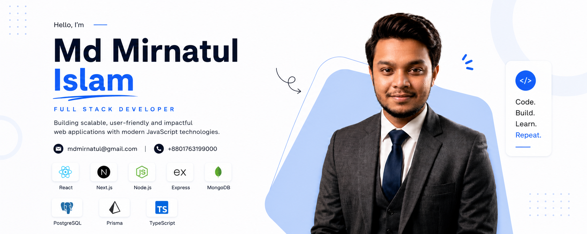

<!-- Banner -->

   

<!-- About Me -->

  

<h1>
  Md Mirnatul Islam
</h1>

A passionate <b>Full-Stack</b> web developer (<b>MERN</b>) from <b>Bangladesh</b>.

  

  Hello! I'm Md Mirnatul Islam, a final-year Computer Science and Engineering student at Dhaka International University and a Full-Stack Developer. I build modern, scalable web applications using React, Next.js, Node.js, Express.js, TypeScript, PostgreSQL, Prisma, MongoDB, and Tailwind CSS.

I'm passionate about learning new technologies, solving real-world problems, and writing clean, maintainable code. Feel free to explore my projects and download my resume to learn more about my work.

 

  
  
  
  
  

 

- 🔭 I’m currently building my project using Next.js, PostgreSQL, Prisma  
- 🌿 I’m currently learning advance full stack tools  
- 👨‍💻 All of my projects are available at [https://mirnatul.netlify.app/](https://mirnatul.netlify.app/)  
- 💬 Ask me about Next.js, Node.js, Express.js, MongoDB, PostgreSQL, Prisma  
- 📩 How to reach me mdmirnatul@gmail.com  
- ⚡ Fun fact I love to watch sci-fi, history movie/series  

  

<!-- Tools and Language -->
<h2 align="left">🛠 Languages & Tools</h2>

<table>
  <tr>
    <td><b>Languages</b></td>
    <td>
      
    </td>
  </tr>
  <tr>
    <td><b>Frontend</b></td>
    <td>
      
    </td>
  </tr>
  <tr>
    <td><b>Backend</b></td>
    <td>
      
    </td>
  </tr>
  <tr>
    <td><b>Databases</b></td>
    <td>
      
    </td>
  </tr>
  <tr>
    <td><b>Tools</b></td>
    <td>
      
    </td>
  </tr>
  <tr>
    <td><b>Problem Solving</b></td>
    <td>
      

        
        
      

    </td>
  </tr>
</table>

  

<!-- Top Language -->
## 📊 GitHub Analytics

  

  

 

  

